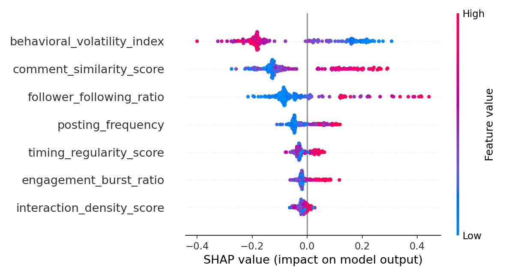
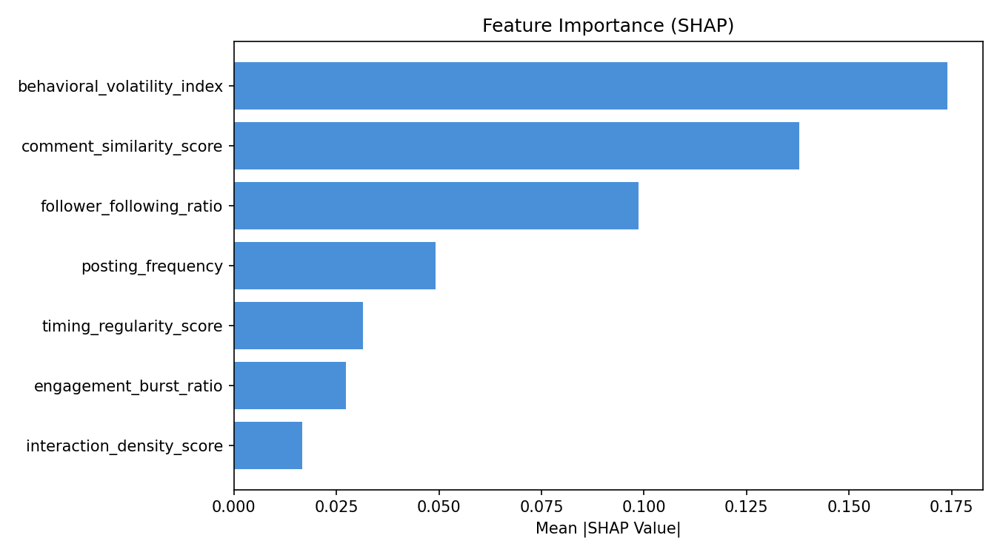

# 🤖 Fake Engagement Detection — Hybrid ML Model

A hybrid machine learning system for detecting fake/bot accounts on social media platforms using **Isolation Forest** (unsupervised anomaly detection) and **Random Forest** (supervised classification), with full **SHAP-based explainability**.

---

## 📁 Repository Structure

```
├── Fake_Engagement_Hybrid_Model.ipynb   # Main training notebook
├── generate_dataset.py                  # Synthetic dataset generator
├── social_media_dataset.csv             # Generated dataset (1,000 samples)
├── outputs/
│   ├── metrics.json                     # Evaluation metrics
│   ├── feature_importance.csv           # SHAP-based feature importance scores
│   ├── feature_importance.png           # Feature importance bar chart
│   └── shap_summary.png                 # SHAP beeswarm summary plot
├── models/                              # Saved model artefacts (auto-generated)
│   ├── rf_model.pkl
│   ├── iso_forest.pkl
│   ├── scaler.pkl
│   └── shap_explainer.pkl
├── requirements.txt
└── README.md
```

---

## 🧠 Model Architecture

This project employs a **two-stage hybrid pipeline**:

| Stage | Model | Role |
|-------|-------|------|
| 1 | Isolation Forest | Unsupervised outlier / anomaly detection |
| 2 | Random Forest | Supervised binary classification (Bot vs. Organic) |
| 3 | SHAP TreeExplainer | Post-hoc model explainability |

The Isolation Forest provides an anomaly signal (decision score) that complements the supervised classifier, making the system robust to previously unseen bot patterns.

---

## 📊 Dataset

The dataset consists of **1,000 synthetic social media accounts** (800 train / 200 test) described by 7 behavioural features:

| Feature | Description |
|---------|-------------|
| `timing_regularity_score` | Regularity of posting intervals |
| `engagement_burst_ratio` | Ratio of sudden engagement spikes |
| `comment_similarity_score` | Semantic similarity across comments |
| `interaction_density_score` | Volume of interactions per unit time |
| `follower_following_ratio` | Ratio of followers to accounts followed |
| `posting_frequency` | Average posts per day |
| `behavioral_volatility_index` | Variance in overall behavioural patterns |

**Class distribution:** ~70% Organic accounts (`label=0`), ~30% Bot accounts (`label=1`).

---

## 📈 Model Performance

| Metric | Score |
|--------|-------|
| **Accuracy** | 98.00% |
| **ROC-AUC** | 99.82% |

### Confusion Matrix

```
                 Predicted: Organic   Predicted: Bot
Actual: Organic       138                  2
Actual: Bot             2                 58
```

- **Precision (Bot):** 0.97  
- **Recall (Bot):** 0.97  
- **F1-Score (Bot):** 0.97  

---

## 🔍 Feature Importance (SHAP)

SHAP (SHapley Additive exPlanations) values were used to interpret the Random Forest model. Features are ranked by their mean absolute SHAP value:

| Rank | Feature | Mean \|SHAP\| |
|------|---------|--------------|
| 1 | `behavioral_volatility_index` | 0.1740 |
| 2 | `comment_similarity_score` | 0.1378 |
| 3 | `follower_following_ratio` | 0.0986 |
| 4 | `posting_frequency` | 0.0491 |
| 5 | `timing_regularity_score` | 0.0315 |
| 6 | `engagement_burst_ratio` | 0.0273 |
| 7 | `interaction_density_score` | 0.0166 |

**Key insight:** `behavioral_volatility_index` is the single strongest predictor. Low volatility (i.e., highly regular, scripted behaviour) strongly pushes the model toward a bot classification, while high volatility is characteristic of organic human users.

### SHAP Summary Plot


### Feature Importance Chart


---

## ⚙️ Installation & Usage

### 1. Clone the Repository

```bash
git clone https://github.com/<your-username>/fake-engagement-detection.git
cd fake-engagement-detection
```

### 2. Install Dependencies

```bash
pip install -r requirements.txt
```

### 3. Generate the Dataset

```bash
python generate_dataset.py
```

This will create `social_media_dataset.csv` in the project root.

### 4. Run the Training Notebook

Open and execute `Fake_Engagement_Hybrid_Model.ipynb` in Jupyter or Google Colab. All outputs (models, metrics, plots) will be saved automatically.

---

## 🛠️ Dependencies

See `requirements.txt` for the full list. Core libraries include:

- `scikit-learn` — Isolation Forest, Random Forest, evaluation metrics
- `shap` — Model explainability
- `pandas` / `numpy` — Data manipulation
- `matplotlib` — Visualisation

---

## 📌 Notes

- All models are serialised using `pickle` and saved to the `models/` directory upon training completion.
- The `StandardScaler` fitted on training data is also saved to ensure consistent preprocessing at inference time.
- This project uses a **synthetic dataset** for demonstration purposes. Real-world deployment would require platform-specific data collection and validation.

---

## 📄 License

This project is licensed under the MIT License. See `LICENSE` for details.
